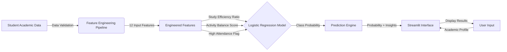

# 🎓 First Class Predictor
[](https://student-performance-prediction-app-web.streamlit.app/)


A production-ready Machine Learning system that predicts a student's likelihood of graduating with **first-class honors** based on academic patterns, study habits, and extracurricular engagement. The system analyzes 60+ academic departments and delivers real-time probability predictions with actionable insights for academic improvement.

> **🔴 Live Demo:** <https://student-performance-prediction-app-web.streamlit.app/>

## 🏗️ System Architecture

This pipeline implements an end-to-end classification system with automated feature engineering and model inference.


## 🛠️ Tech Stack

**Machine Learning & Data:** Scikit-learn (Logistic Regression), Pandas, NumPy

**Feature Engineering:** OneHotEncoder, Custom ratio metrics, Activity normalization

**Deployment:** Streamlit, Python

## 🚀 Key Engineering Features

* **Multi-Department Classification:** Trained on 60+ academic departments with department-aware encoding using `OneHotEncoder`, capturing the variance in academic rigor across disciplines.
* **Automated Feature Engineering:** Implemented 3 custom engineered features:
  - **Study Efficiency Ratio:** Quantifies study time effectiveness relative to course load
  - **Activity Balance Score:** Measures extracurricular involvement against academic commitment
  - **High Attendance Flag:** Binary threshold feature for attendance impact analysis
* **Class Imbalance Handling:** Utilized `class_weight='balanced'` in Logistic Regression to address skewed distribution of first-class graduates in training data.
* **Model Persistence:** Serialized trained model using `joblib` for instant inference without retraining, enabling sub-second prediction latency.
* **Robust Validation:** Integrated data validation and error handling to manage missing values and outliers in user input.

## 💻 How to Run Locally

1. **Clone the repository**
```bash
git clone https://github.com/Datechgeek/Student-Performance-Prediction-App.git
cd Student-Performance-Prediction-App
```

2. **Install dependencies**
```bash
pip install -r requirements.txt
```

3. **Run the application**
```bash
streamlit run app.py
```

## 📊 Model Performance & Insights

* **Algorithm:** Logistic Regression with SAGA solver
* **Training Data:** 215 student records across 13 features
* **Model Configuration:**
  - Balanced class weights for handling first-class rarity
  - Max iterations: 1000
  - Random state: 42 (reproducibility)
* **Feature Importance:** The model identified **study hours**, **attendance**, and **exam preparation** as the top 3 predictors of first-class graduation.

### Model Configuration
```python
LogisticRegression(
    class_weight='balanced',
    max_iter=1000,
    solver='saga',
    random_state=42
)
```

## 🎯 Application Features

* **Real-Time Predictions:** Instant probability calculation for first-class graduation likelihood
* **Interactive Visualizations:** Dynamic gauge charts displaying prediction confidence
* **Personalized Recommendations:** Context-aware improvement suggestions based on input profile
* **Feature Impact Analysis:** Transparent explanation of which factors drive the prediction

---

**Author:** Micah Okpara

*Connect with me:* [LinkedIn](https://www.linkedin.com/in/micah-okpara/) | [Twitter](https://x.com/Micah_AI)
